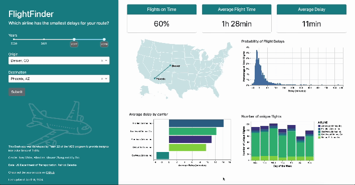

# FlightFinder: Navigate US Air Travel with Confidence

Welcome to FlightFinder, a dashboard for travelers seeking to make informed decisions about their United States air travel. Our platform leverages extensive flight data to offer insights into historical delay patterns and airline punctuality records. Whether you're planning a business trip or a vacation, FlightFinder equips you with the knowledge to choose flights that align with your schedule and preferences.

## For Dashboard Users

### Why FlightFinder?

In a world where time is of the essence, unexpected flight delays can disrupt carefully planned schedules. FlightFinder addresses this challenge by providing access to historical flight performance data. Here's how our dashboard empowers travelers:

- **Historical Delay Patterns:** Avoid peak delay times by understanding when flights are most likely to be delayed.
- **Airline Punctuality Records:** Compare airlines to choose the most reliable one for your journey.

Explore our dashboard to plan your travels with confidence. For any support, feel free to [open an issue](https://github.com/UBC-MDS/DSCI-532_2024_22_flightfinder/issues/new).

### Getting Started

Dive into our dashboard [here](https://dsci-532-2024-22-flightfinder.onrender.com/) and start optimizing your travel plans today.

## For Developers and Contributors

Interested in contributing to FlightFinder? We welcome developers who are eager to help us enhance this platform. Here's how you can get started:



### Running the App Locally

1. Clone the repository:
```git clone https://github.com/UBC-MDS/DSCI-532_2024_22_flightfinder.git```

2. Install the dependencies:
```pip install -r requirements.txt```

3. Run the application:
```python src/app.py```


